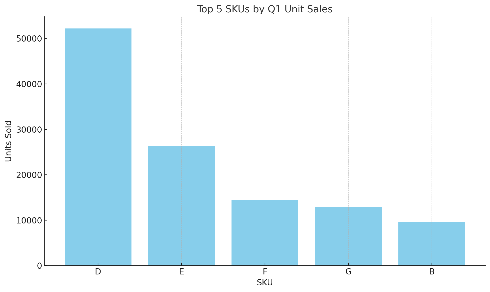

# SQL-style Sales Insights (Q1 2024)

This project replicates a SQL-style business report in Python using pandas. The data tracks SKU-level unit sales across Q1 (January–March) 2024.

---

## 📊 Objective

Build an analytical report that:
- Calculates monthly unit sales per SKU
- Computes total Q1 unit sales
- Calculates sales share for each month and Q1
- Ranks SKUs by total Q1 sales
- Visualizes top-performing products

---

## 🧠 Analysis Features

- `pivot_table` to summarize monthly sales
- `sum`, `rank`, and `groupby` for total and relative performance
- Share calculations by dividing SKU sales by total market sales
- Ranking logic to highlight leaders

---

## 🏆 Sample Output

| SKU | Jan | Feb | Mar | Q1 Total | Q1 Rank |
|-----|-----|-----|-----|----------|---------|
| A   | 500 | 600 | 700 | 1800     | 1       |
| B   | ... | ... | ... | ...      | ...     |

---

## 📈 Visualization



---

## 📁 Files

- `q1_sql_summary.py` – Python script with full logic
- `top5_q1_sales.png` – Visualization of top 5 SKUs by unit sales
- `README.md` – This file

---

## 🚀 How to Run

```bash
pip install pandas matplotlib openpyxl
python q1_sql_summary.py
```

---

## 👨‍💻 Author

**Samuel Fairley**  
[LinkedIn](https://www.linkedin.com/in/samuelfairley) | [GitHub](https://github.com/scfairle)
